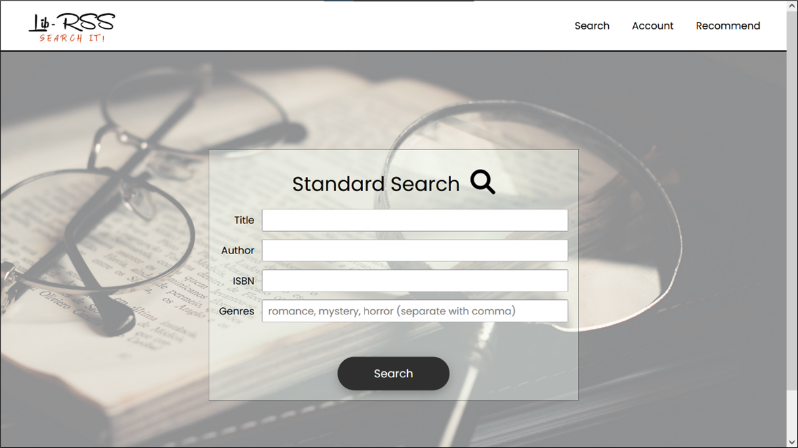

# LibRSS
LibRSS is a tool for people to search books based on either the information about the book (e.g., author, published year etc.), or by plots where they can input a short summary of content they would like to read. It provides a solution for the common problem where one does not have a specific book in mind but wishes to read about certain types of stories and genre is too broad to search by. 

Additionally, it acts as a book cataloging website where users can rate, save, share or get recommendations about books available on the website.



### Table of contents
[Getting started](https://github.com/holegrain/cz2006#getting-started)
[Contributing](https://github.com/holegrain/cz2006#contributing--issues)
[License](https://github.com/holegrain/cz2006#license)

### Features
- Book information search
- Advance plot search
- Recommend books
- Share books
- View book details
- Rate books
- Save books

### Build with
- [Anaconda](https://www.anaconda.com/)
- [Django](https://www.djangoproject.com/)
- [Python](https://www.python.org/)
- [Huawei Cloud](https://www.huaweicloud.com/intl/en-us/)

## Getting Started
This project has been deployed on both Windows and Ubuntu.

### Prerequisite
- Database server
- Windows/Ubuntu OS
- Anaconda

### Installation
1. Clone the repo
```
git clone https://github.com/holegrain/cz2006
cd cz2006
```

2. Create environment with `environment.yml`
```
conda env create -f environment.yml
conda activate softengg
cd src
```

For **Ubuntu OS**, additional packages need to be installed with
```
sudo apt-get install mysql-client
sudo apt-get install libmysqlclient-dev
```

3. Modify variables
    1. In `cz2006/settings.py`, the variables `EMAIL_BACKEND, EMAIL_HOST, EMAIL_HOST_USER, EMAIL_HOST_PASSWORD` needs to be modified to your own email.
    2. In the same file, the host where the website will be hosted on needs to be added to `ALLOWED_HOSTS`
    3. In the same file, `DATABASES` needs to be modified to have your own local database

4. Run `python manage.py runserver` to start the website

## Contributing & issues
Contributions from all over the world has always been a key for open sources projects. We welcome you to contribute by forking out your own branch. Any problems with the app can be raised as an issue.

## License
This software is distributed under the [MIT License](LICENSE).
